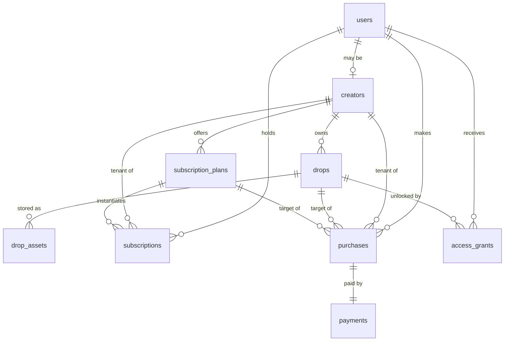

# Database Design (Revision 2)

Postgres (Supabase). Drizzle schema; migrations generated only after this revision is approved.

**Changes from Session 1:** drops gain `access_type` (free | premium | pay_per_unlock, per Q2) and Supabase-Storage-based content columns (per Q1); `access_grants` simplified per ADR-011 (no subscription-scoped grants); `creator_id` tenancy columns added platform-wide per ADR-012; new `drop_assets` table for storage metadata + per-transport delivery cache; `bot_settings` becomes tenant-scopable.

Conventions (unchanged): uuid PKs · `bigint` telegram ids · integer Stars, never floats · `timestamptz` · Postgres enums · status transitions over deletion.

**Rev 2.1 (2026-07-04):** `audit_logs` (§10) and `system_settings` (§11) are now fully specified inline, derived from the current architecture only — this document no longer references superseded Session-1 material anywhere a column definition depends on it. No other tables changed.

**Rev 2.2 (2026-07-04):** Tyler-approved revisions to rev 2.1 applied: `audit_logs.action` → `varchar(100)` and `audit_logs.entity_type` → `varchar(50)` (no enums; allowed values Zod-validated in the application layer) · `system_settings` gains `category varchar(50)` and nullable `updated_by uuid FK → users` · AuditRepository documented as append-only (`append`/`find*` only, never `update`/`delete`). Pending Tyler's approval before M2 migration generation.

## Entity relationship overview



## Tables

### 1. users
Unchanged from S1: `id`, `telegram_id bigint unique not null`, `username`, `first_name`, `last_name`, `language_code`, `is_blocked bool default false`, timestamps, `last_seen_at`.
Note: users are **platform-level**, not tenant-owned — one Telegram user can buy from many creators.

### 2. creators — the tenant table
Unchanged from S1: `id`, `user_id FK unique`, `display_name`, `bio`, `status (active|suspended|pending)`, timestamps. M7.0–M7.3 added `slug` (unique), `avatar_url`, `onboarding_completed_at`, `category`, `is_featured`.
Every tenant-owned row below points here. MVP seeds one creator.
Marketplace indexes (M7.3.1, migration `0006`): partial btree `(is_featured, created_at) WHERE` discoverable (active + slug + onboarded) for the list/sort; partial `(category)` for the category filter; and **pg_trgm GIN** indexes on `display_name`/`slug` for the ILIKE search (the `pg_trgm` extension is created in the same migration; these are hand-maintained in the migration, not the Drizzle snapshot).

### 3. drops (revised)

| Column | Type | Notes |
|---|---|---|
| id | uuid PK | |
| creator_id | uuid FK → creators, not null | tenant key |
| title / description / preview_text | text | description+preview shown pre-unlock |
| **access_type** | **enum: `free` \| `premium` \| `pay_per_unlock`** | Q2 |
| price_stars | integer null | CHECK: `(access_type='pay_per_unlock' AND price_stars > 0) OR (access_type <> 'pay_per_unlock' AND price_stars IS NULL)` |
| status | enum: draft \| published \| archived | |
| published_at, created_at, updated_at | timestamptz | |

Content columns move to `drop_assets` (a drop can be an album = N assets).
Indexes: `(creator_id, status)`, partial `(creator_id, access_type) WHERE status='published'` (browse queries).

### 4. drop_assets (new)
Storage source of truth (Q1) + delivery cache.

| Column | Type | Notes |
|---|---|---|
| id | uuid PK | |
| drop_id | uuid FK → drops, not null | |
| creator_id | uuid FK → creators, not null | tenant key (denormalized) |
| position | integer default 0 | ordering within albums |
| content_type | enum: text \| photo \| video \| document | |
| storage_bucket | text not null | e.g. `drops` |
| storage_path | text not null | `creators/{creatorId}/drops/{dropId}/{uuid}.{ext}` |
| mime_type | text | |
| file_size_bytes | bigint | |
| text_content | text null | for content_type=text (no storage object) |
| transport_cache | jsonb null | e.g. `{"telegram:<botId>": "<file_id>"}` — **rebuildable optimization, never authoritative** |
| created_at / updated_at | timestamptz | |

Unique `(drop_id, position)`; index `(creator_id)`.
CHECK: text type ⇒ `text_content` set; media types ⇒ storage path set.

### 5. subscription_plans
As S1 (`creator_id`, name, description, `price_stars > 0`, `duration_days > 0`, status active|retired, timestamps). MVP seeds exactly **one** Premium plan (Q3); schema already supports tiers.

### 6. subscriptions
As S1: `user_id`, `plan_id`, `creator_id` (tenant, denormalized), status `active|expired|cancelled`, `started_at`, `expires_at`, `cancelled_at`, timestamps.
Constraints: partial unique `(user_id, creator_id) WHERE status='active'` (M7.3.1, migration `0005` — one active subscription per **creator**, the entitlement grain per ADR-011; replaces the former per-plan `(user_id, plan_id)` index); **`(user_id, creator_id, status)` index — serves the live premium entitlement check (ADR-011)**; `(status, expires_at)` for the sweep.

### 7. purchases (revised: +creator_id)
As S1 plus `creator_id uuid FK not null` (tenant key). Same XOR CHECK between drop_id/plan_id, same `payment_id` unique 1:1, `amount_stars` snapshot, status pending|completed|failed|refunded.
Indexes: `(user_id, created_at DESC)` for /library; `(creator_id, created_at DESC)` for future creator dashboards.

### 8. payments (revised: +creator_id)
As S1 plus `creator_id uuid FK not null` — payments are tenant revenue and must be filterable per creator without joins (future payouts). Unchanged: provider enum `mock|telegram_stars` (renamed value `mock` — provider-neutral per revision §2), `provider_charge_id`, **unique `idempotency_key`**, `amount_stars > 0`, currency default 'XTR', status, `raw_payload jsonb`.
Indexes: unique idempotency_key; `(provider, provider_charge_id)`; `(creator_id, status, created_at)`; partial `(created_at) WHERE status='pending'` (M7.3.1, migration `0006`) — serves the global stale-pending cleanup sweep, which filters status+created_at with no creator_id and so cannot use the composite index.

### 9. access_grants (simplified per ADR-011)
Ledger for **pay-per-unlock purchases and manual comps only**. Subscription entitlement is computed live and never materialized here.

| Column | Type | Notes |
|---|---|---|
| id | uuid PK | |
| user_id | uuid FK, not null | |
| drop_id | uuid FK, not null | now NOT NULL (grants are always drop-specific) |
| creator_id | uuid FK, not null | tenant key |
| grant_type | enum: `purchase` \| `manual` | `subscription` value dropped |
| source_purchase_id | uuid FK null | provenance (null for manual) |
| revoked_at | timestamptz null | manual revocation/refund path |
| created_at | timestamptz | |

`expires_at` dropped (purchase grants are permanent; time-boxing returns only if a business case does).
Access predicate: `revoked_at IS NULL`.
Constraints: **partial unique `(user_id, drop_id) WHERE revoked_at IS NULL`** — one live grant per user per drop, DB-enforced; index `(creator_id)`.

### The full entitlement rule (AccessService, single source of truth)
```
free            → drop.status='published'
premium         → published AND EXISTS subscription(user, drop.creator_id,
                                    status='active', expires_at > now())
pay_per_unlock  → published AND EXISTS grant(user, drop, revoked_at IS NULL)
```

### 10. audit_logs (rev 2.2 — fully specified, self-contained)
Append-only ledger. Every money/access mutation writes its row **in the same transaction** as the mutation (golden rule 4); domain-event handlers may append *enrichment* rows after commit, but the core row is never event-driven (ADR-010).

| Column | Type | Purpose |
|---|---|---|
| id | uuid PK | row identity |
| creator_id | uuid FK → creators, null | tenant attribution for per-creator timelines (ADR-012); **NULL = platform-level event** (e.g. user registration) |
| action | varchar(100) not null | what happened, dot-namespaced `entity.verb`: `user.registered`, `payment.succeeded`, `payment.failed`, `purchase.completed`, `subscription.activated`, `subscription.expired`, `subscription.renewed`, `grant.created`, `grant.revoked`, `content.delivered`, `content.uploaded`. Deliberately **varchar, not a Postgres enum**: the vocabulary grows with every feature, and an append-only ledger must accept new verbs without a migration. Bounded at 100 chars to prevent arbitrary-length values and keep the index tight. Allowed values are validated in the application layer — AuditService's typed Zod list (ADR-013) — so free-text drift cannot occur in practice. |
| entity_type | varchar(50) not null | which aggregate the entry describes: `user`, `creator`, `drop`, `drop_asset`, `subscription_plan`, `subscription`, `purchase`, `payment`, `access_grant`. **varchar(50), not an enum**, for the same extensibility reason as `action`; allowed values Zod-validated in the application layer. |
| entity_id | uuid not null | PK of the affected row. No FK — the reference is polymorphic across `entity_type`, which a single FK cannot express; integrity is guaranteed by AuditService writing in the same transaction as the mutation it records. |
| actor_type | enum: `user` \| `system` \| `job`, not null | who caused the mutation: a user action via a client adapter, the platform itself (seed, manual ops/comps), or a background job (e.g. the expiration sweep). Closed set → Postgres enum per conventions. |
| actor_user_id | uuid FK → users, null | the acting user when `actor_type='user'`; NULL otherwise (CHECK below) |
| correlation_id | text null | the Pino correlationId of the originating update or job-run (ADR-015), so any ledger row can be joined to its structured logs when investigating an incident |
| context | jsonb null | action-specific snapshot: `amount_stars`, `provider`, failure `reason`, `storage_path`, `expires_at`, etc. (jsonb flexibility per ADR-002). Never authoritative — authoritative state lives in the domain tables; this exists so the ledger reads standalone. |
| created_at | timestamptz not null default now() | when the row was written (same transaction as the mutation it records) |

Constraints & indexes:
- **Append-only:** no `updated_at` by design; AuditService issues INSERTs only, never UPDATE/DELETE. DB-level revocation of UPDATE/DELETE arrives with RLS (debt #2).
- **Repository contract (AuditRepository):** append-only by construction. It exposes `append()`, `find()`, `findByEntity()`, `findByCreator()`, `findByCorrelation()` — and **never** `update()` or `delete()`. The audit log is immutable by design; immutability is enforced at the repository interface, not left to caller discipline.
- CHECK: `(actor_type = 'user') = (actor_user_id IS NOT NULL)` — user actions always name the user; system/job actions never do.
- Indexes: `(entity_type, entity_id)` — "full history of this row"; `(creator_id, created_at)` — per-tenant timelines and future creator dashboards; BRIN on `created_at` at volume.

### 11. bot_settings (revised: tenant-scopable) & system_settings (rev 2.2 — fully specified)
`bot_settings`: `id`, **`creator_id uuid FK null`** (null = platform default; row with creator_id overrides), `key`, `value jsonb` (Zod-validated on read), `description`, `updated_at`. Unique `(creator_id, key)` with null-distinct handling via coalesced unique index.

`system_settings` — global platform switches. Same shape as `bot_settings` minus tenancy (global by definition, so no `creator_id`):

| Column | Type | Purpose |
|---|---|---|
| id | uuid PK | row identity |
| key | text not null, **unique** | dot-namespaced setting name: `maintenance_mode`, `payments.mock_enabled`, `sweep.interval` |
| category | varchar(50) not null | groups related settings for administration and filtering: `payments`, `telegram`, `storage`, `jobs`, `maintenance`. Allowed values Zod-validated in the application layer; varchar keeps it extensible without migration. |
| value | jsonb not null | the setting value; jsonb so booleans, numbers, and structured values share one column. **Zod-validated on read** (ADR-013) — an invalid value fails loudly at the reading service, never silently. |
| description | text null | operator-facing note on what the switch does and its safe values — the table documents itself |
| updated_by | uuid FK → users, null | which authenticated user last changed the setting — future admin-dashboard provenance, modeled now to avoid a later migration. **NULL for system-generated changes and throughout MVP** (no admin UX exists yet). |
| updated_at | timestamptz not null default now() | last change; settings are updated in place (no status lifecycle, so no other timestamps needed) |

Notes: written by SettingsRepository (manual in MVP — no admin UX). Env vars remain the boot-time configuration (SETUP.md); `system_settings` holds *runtime-flippable* platform switches. MVP reads them at boot (cached-at-boot is debt #4 with trigger "dashboard live-edit"). Seed provides `maintenance_mode=false` (category `maintenance`) and `payments.mock_enabled=true` (category `payments`), both with `updated_by=NULL`.

## Data ownership (sole writers)

| Table | Writer |
|---|---|
| users | UserService |
| creators | CreatorService (seed in MVP) |
| drops, drop_assets | DropService (seed/manual in MVP; ContentProvider writes storage, DropService writes rows) |
| subscription_plans | seed in MVP |
| subscriptions | SubscriptionService (incl. expiration job path) |
| purchases, payments | PurchaseService |
| access_grants | PurchaseService (create) · manual ops (comp/revoke) |
| audit_logs | AuditService (append-only) |
| bot_settings / system_settings | SettingsRepository (manual in MVP) |

## Review notes

- **A.** `drop_assets.transport_cache` is deliberately jsonb keyed by transport+bot so a bot-token migration or a second channel invalidates nothing structurally. It may be wiped at any time with zero data loss.
- **B.** RLS still deferred (trigger: first non-bot client). All tenant keys are in place for it.
- **C.** No balances anywhere — Telegram owns wallets; we record transactions only.
- **D.** Storage bucket is private; DB stores paths, never public URLs.
