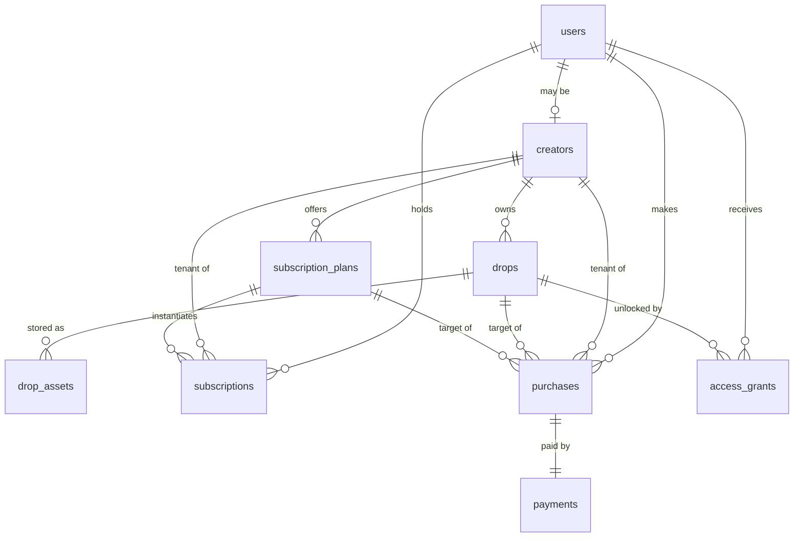

# Database Design (Revision 2)

Postgres (Supabase). Drizzle schema; migrations generated only after this revision is approved.

**Changes from Session 1:** drops gain `access_type` (free | premium | pay_per_unlock, per Q2) and Supabase-Storage-based content columns (per Q1); `access_grants` simplified per ADR-011 (no subscription-scoped grants); `creator_id` tenancy columns added platform-wide per ADR-012; new `drop_assets` table for storage metadata + per-transport delivery cache; `bot_settings` becomes tenant-scopable.

Conventions (unchanged): uuid PKs · `bigint` telegram ids · integer Stars, never floats · `timestamptz` · Postgres enums · status transitions over deletion.

## Entity relationship overview



## Tables

### 1. users
Unchanged from S1: `id`, `telegram_id bigint unique not null`, `username`, `first_name`, `last_name`, `language_code`, `is_blocked bool default false`, timestamps, `last_seen_at`.
Note: users are **platform-level**, not tenant-owned — one Telegram user can buy from many creators.

### 2. creators — the tenant table
Unchanged from S1: `id`, `user_id FK unique`, `display_name`, `bio`, `status (active|suspended|pending)`, timestamps.
Every tenant-owned row below points here. MVP seeds one creator.

### 3. drops (revised)

| Column | Type | Notes |
|---|---|---|
| id | uuid PK | |
| creator_id | uuid FK → creators, not null | tenant key |
| title / description / preview_text | text | description+preview shown pre-unlock |
| **access_type** | **enum: `free` \| `premium` \| `pay_per_unlock`** | Q2 |
| price_stars | integer null | CHECK: `(access_type='pay_per_unlock' AND price_stars > 0) OR (access_type <> 'pay_per_unlock' AND price_stars IS NULL)` |
| status | enum: draft \| published \| archived | |
| published_at, created_at, updated_at | timestamptz | |

Content columns move to `drop_assets` (a drop can be an album = N assets).
Indexes: `(creator_id, status)`, partial `(creator_id, access_type) WHERE status='published'` (browse queries).

### 4. drop_assets (new)
Storage source of truth (Q1) + delivery cache.

| Column | Type | Notes |
|---|---|---|
| id | uuid PK | |
| drop_id | uuid FK → drops, not null | |
| creator_id | uuid FK → creators, not null | tenant key (denormalized) |
| position | integer default 0 | ordering within albums |
| content_type | enum: text \| photo \| video \| document | |
| storage_bucket | text not null | e.g. `drops` |
| storage_path | text not null | `creators/{creatorId}/drops/{dropId}/{uuid}.{ext}` |
| mime_type | text | |
| file_size_bytes | bigint | |
| text_content | text null | for content_type=text (no storage object) |
| transport_cache | jsonb null | e.g. `{"telegram:<botId>": "<file_id>"}` — **rebuildable optimization, never authoritative** |
| created_at / updated_at | timestamptz | |

Unique `(drop_id, position)`; index `(creator_id)`.
CHECK: text type ⇒ `text_content` set; media types ⇒ storage path set.

### 5. subscription_plans
As S1 (`creator_id`, name, description, `price_stars > 0`, `duration_days > 0`, status active|retired, timestamps). MVP seeds exactly **one** Premium plan (Q3); schema already supports tiers.

### 6. subscriptions
As S1: `user_id`, `plan_id`, `creator_id` (tenant, denormalized), status `active|expired|cancelled`, `started_at`, `expires_at`, `cancelled_at`, timestamps.
Constraints: partial unique `(user_id, plan_id) WHERE status='active'`; **`(user_id, creator_id, status)` index — this now serves the live premium entitlement check (ADR-011)**; `(status, expires_at)` for the sweep.

### 7. purchases (revised: +creator_id)
As S1 plus `creator_id uuid FK not null` (tenant key). Same XOR CHECK between drop_id/plan_id, same `payment_id` unique 1:1, `amount_stars` snapshot, status pending|completed|failed|refunded.
Indexes: `(user_id, created_at DESC)` for /library; `(creator_id, created_at DESC)` for future creator dashboards.

### 8. payments (revised: +creator_id)
As S1 plus `creator_id uuid FK not null` — payments are tenant revenue and must be filterable per creator without joins (future payouts). Unchanged: provider enum `mock|telegram_stars` (renamed value `mock` — provider-neutral per revision §2), `provider_charge_id`, **unique `idempotency_key`**, `amount_stars > 0`, currency default 'XTR', status, `raw_payload jsonb`.
Indexes: unique idempotency_key; `(provider, provider_charge_id)`; `(creator_id, status, created_at)`.

### 9. access_grants (simplified per ADR-011)
Ledger for **pay-per-unlock purchases and manual comps only**. Subscription entitlement is computed live and never materialized here.

| Column | Type | Notes |
|---|---|---|
| id | uuid PK | |
| user_id | uuid FK, not null | |
| drop_id | uuid FK, not null | now NOT NULL (grants are always drop-specific) |
| creator_id | uuid FK, not null | tenant key |
| grant_type | enum: `purchase` \| `manual` | `subscription` value dropped |
| source_purchase_id | uuid FK null | provenance (null for manual) |
| revoked_at | timestamptz null | manual revocation/refund path |
| created_at | timestamptz | |

`expires_at` dropped (purchase grants are permanent; time-boxing returns only if a business case does).
Access predicate: `revoked_at IS NULL`.
Constraints: **partial unique `(user_id, drop_id) WHERE revoked_at IS NULL`** — one live grant per user per drop, DB-enforced; index `(creator_id)`.

### The full entitlement rule (AccessService, single source of truth)
```
free            → drop.status='published'
premium         → published AND EXISTS subscription(user, drop.creator_id,
                                    status='active', expires_at > now())
pay_per_unlock  → published AND EXISTS grant(user, drop, revoked_at IS NULL)
```

### 10. audit_logs (revised: +creator_id)
As S1 plus `creator_id uuid null` (null = platform-level event). Append-only, no updates/deletes. Actions extended: `payment.succeeded/failed`, `purchase.completed`, `subscription.activated/expired/renewed`, `grant.created/revoked`, `content.delivered`, `content.uploaded`.
Indexes: `(entity_type, entity_id)`, `(creator_id, created_at)`, BRIN on created_at at volume.

### 11. bot_settings (revised: tenant-scopable) & system_settings
`bot_settings`: `id`, **`creator_id uuid FK null`** (null = platform default; row with creator_id overrides), `key`, `value jsonb` (Zod-validated on read), `description`, `updated_at`. Unique `(creator_id, key)` with null-distinct handling via coalesced unique index.
`system_settings`: unchanged — global platform switches (`maintenance_mode`, `payments.mock_enabled`, `sweep.interval`).

## Data ownership (sole writers)

| Table | Writer |
|---|---|
| users | UserService |
| creators | CreatorService (seed in MVP) |
| drops, drop_assets | DropService (seed/manual in MVP; ContentProvider writes storage, DropService writes rows) |
| subscription_plans | seed in MVP |
| subscriptions | SubscriptionService (incl. expiration job path) |
| purchases, payments | PurchaseService |
| access_grants | PurchaseService (create) · manual ops (comp/revoke) |
| audit_logs | AuditService (append-only) |
| bot_settings / system_settings | SettingsRepository (manual in MVP) |

## Review notes

- **A.** `drop_assets.transport_cache` is deliberately jsonb keyed by transport+bot so a bot-token migration or a second channel invalidates nothing structurally. It may be wiped at any time with zero data loss.
- **B.** RLS still deferred (trigger: first non-bot client). All tenant keys are in place for it.
- **C.** No balances anywhere — Telegram owns wallets; we record transactions only.
- **D.** Storage bucket is private; DB stores paths, never public URLs.
