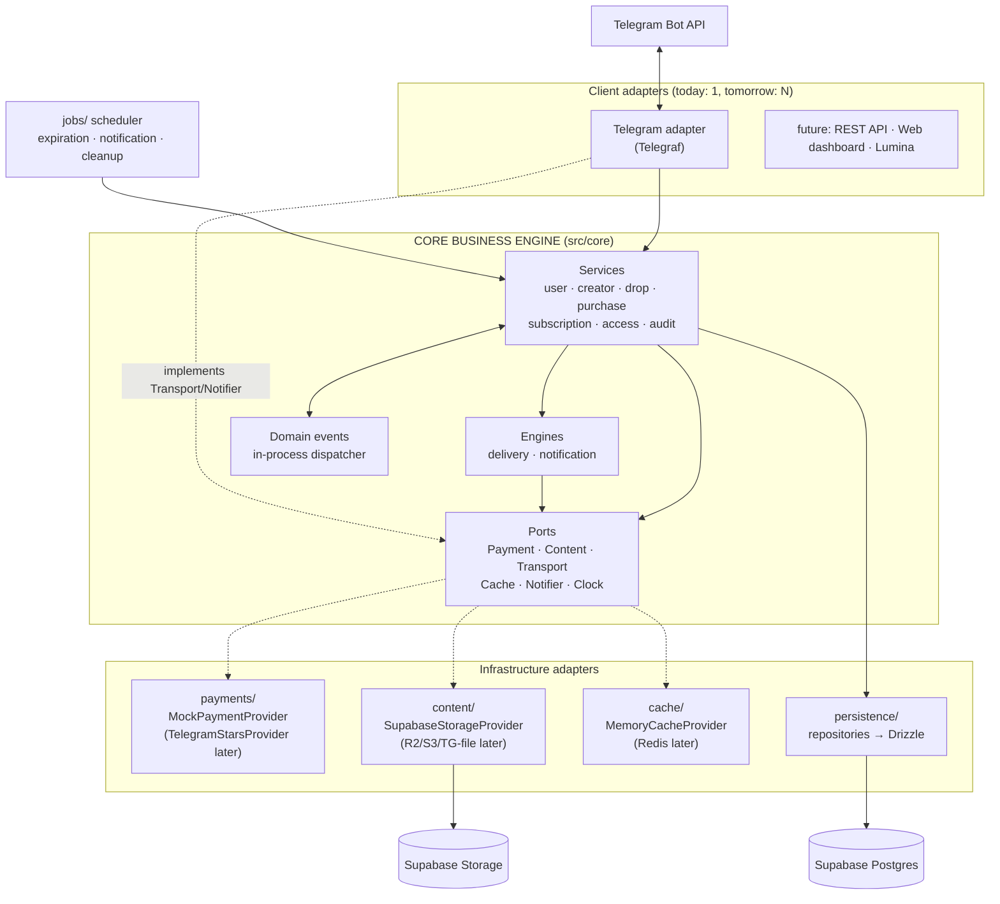
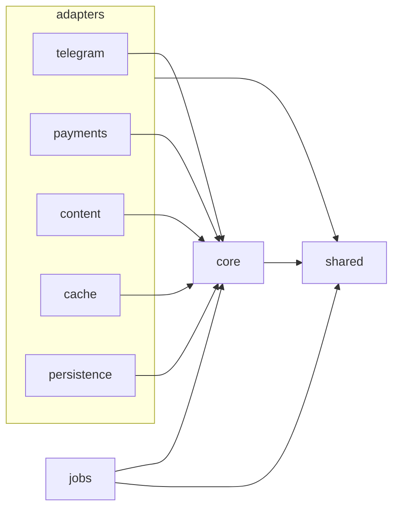
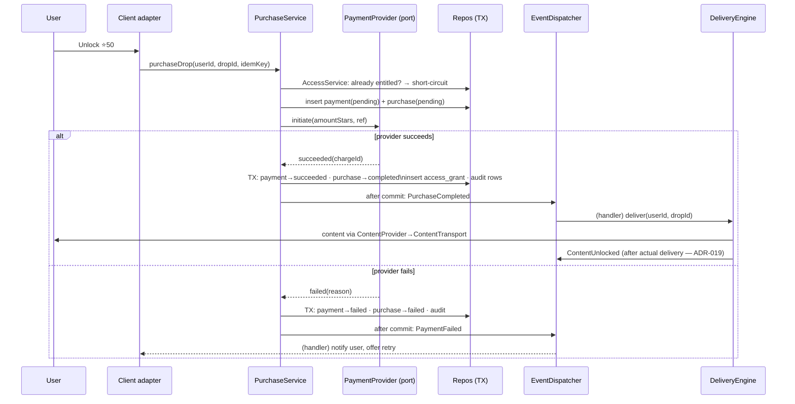
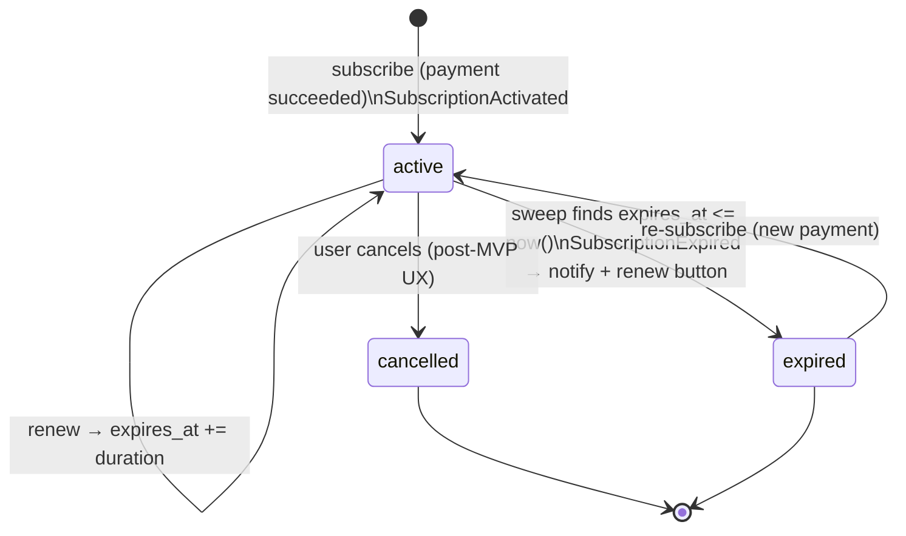
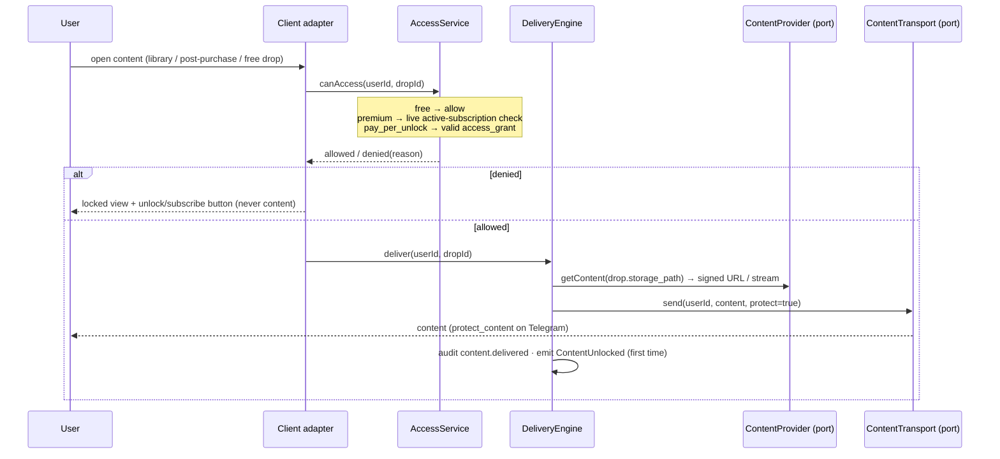
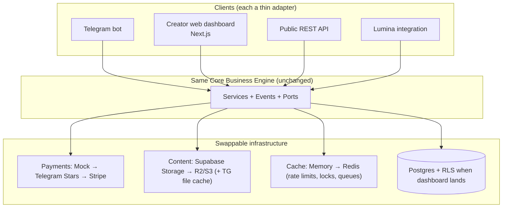

# SYSTEM_ARCHITECTURE

> Supersedes `ARCHITECTURE.md` (Session 1). This is the authoritative architecture document.

## 0. What this system is

A **Creator Monetization Platform**. The core is a channel-agnostic business engine: catalog, payments, entitlements, subscriptions, delivery, events. **Telegram is the first client adapter**, not the application. Future clients (web dashboard, REST API, Lumina integration, mobile) attach to the same core without domain changes.

Three concentric zones:

1. **Core Business Engine** (`src/core/`) — services, engines, domain events, ports. Imports nothing from any adapter. Doesn't know Telegram, Supabase Storage, Redis, or Telegraf exist.
2. **Adapters** (`src/adapters/`) — implementations of core ports: Telegram client, payment providers, content providers, cache providers, persistence.
3. **Composition** (`src/app.ts`, `src/jobs/`) — wires adapters into ports, schedules background work.

## 1. Folder structure (revised)

```
creator-platform/
├── src/
│   ├── index.ts                          # boot: config → app → start clients + jobs
│   ├── app.ts                            # composition root (manual DI, event handler registration)
│   │
│   ├── config/
│   │   ├── env.ts                        # Zod parse-or-crash
│   │   └── constants.ts
│   │
│   ├── shared/                           # leaf layer: types, Result<T,E>, AppError, pure utils
│   │
│   ├── core/                             # ★ CORE BUSINESS ENGINE — zero adapter imports
│   │   ├── ports/
│   │   │   ├── payment-provider.port.ts  # initiate/confirm/refund — provider-agnostic
│   │   │   ├── content-provider.port.ts  # store/retrieve/delete content — storage-agnostic
│   │   │   ├── content-transport.port.ts # deliver content to a user on a channel
│   │   │   ├── cache-provider.port.ts    # get/set/del/ttl/incr — Redis-shaped, not Redis-bound
│   │   │   ├── notifier.port.ts
│   │   │   └── clock.port.ts
│   │   ├── events/
│   │   │   ├── events.ts                 # PurchaseCompleted, SubscriptionActivated,
│   │   │   │                             # SubscriptionExpired, ContentUnlocked, PaymentFailed
│   │   │   ├── dispatcher.ts             # in-process, synchronous, after-commit dispatch
│   │   │   └── handlers/                 # notification handler, audit-enrichment, analytics stub
│   │   ├── services/
│   │   │   ├── user.service.ts
│   │   │   ├── creator.service.ts        # tenant lifecycle (minimal in MVP)
│   │   │   ├── drop.service.ts
│   │   │   ├── purchase.service.ts       # payment state machine + grant issuance
│   │   │   ├── subscription.service.ts
│   │   │   ├── access.service.ts         # THE entitlement oracle (free/premium/unlock)
│   │   │   └── audit.service.ts
│   │   └── engines/
│   │       ├── delivery.engine.ts        # access check → ContentProvider → ContentTransport
│   │       └── notification.engine.ts    # notification intents → Notifier
│   │
│   ├── adapters/
│   │   ├── telegram/                     # FIRST CLIENT (Telegraf confined here)
│   │   │   ├── bot.ts                    # factory: polling/webhook from config
│   │   │   ├── context.ts
│   │   │   ├── commands/  handlers/  middleware/  keyboards/  views/
│   │   │   ├── telegram-content-transport.ts   # implements ContentTransport
│   │   │   └── telegram-notifier.ts            # implements Notifier
│   │   ├── payments/
│   │   │   ├── mock-payment.provider.ts        # MVP (configurable delay + failure rate)
│   │   │   └── telegram-stars.provider.ts      # future; same port
│   │   ├── content/
│   │   │   ├── supabase-storage.provider.ts    # MVP primary (Q1)
│   │   │   └── telegram-file.provider.ts       # future delivery optimization
│   │   ├── cache/
│   │   │   ├── memory-cache.provider.ts        # MVP (rate limiting, idempotency)
│   │   │   ├── noop-cache.provider.ts          # tests
│   │   │   └── redis-cache.provider.ts         # future; same port
│   │   └── persistence/
│   │       ├── db/                             # drizzle client, schema/, migrations/, tx helper
│   │       └── repositories/                   # only Drizzle-aware layer
│   │
│   ├── jobs/
│   │   ├── scheduler.ts                        # interval runner + per-job locking via CacheProvider
│   │   ├── subscription-expiration.job.ts      # sweep → SubscriptionService.expireLapsed()
│   │   ├── notification.job.ts                 # drains queued notification intents (retry on blocked)
│   │   ├── cleanup.job.ts                      # stale pending payments → failed; orphaned uploads
│   │   └── analytics.job.ts                    # registered no-op stub (future)
│   │
│   └── logging/
│       └── logger.ts
│
├── tests/            # unit/ (fakes), integration/ (real Postgres), fakes/
├── docs/
├── .github/workflows/ci.yml                    # typecheck + lint + unit tests (Q5)
├── drizzle.config.ts · vitest.config.ts · tsconfig.json · package.json
```

## 2. Overall system architecture



## 3. Module dependency graph (enforced by ESLint boundary rules)



Rules:
1. `core/` imports only `shared/`. It may not import from `adapters/`, `jobs/`, `telegraf`, `drizzle-orm`, or `@supabase/*`.
2. Adapters import `core/` (to implement its ports and call its services) and `shared/` — never each other. The Telegram adapter cannot import the content adapter; they meet only through core ports.
3. `persistence/repositories` implement the repository interfaces that `core/services` consume; only persistence touches Drizzle.
4. `jobs/` invoke core services/engines; no business logic in job files.
5. `config/env.ts` is read only by `index.ts`/`app.ts`; everything else receives config via construction.
6. Composition (`app.ts`) is the only file allowed to import everything — it's the wiring diagram.

## 4. Request flow (any client, Telegram shown)

```
Update → Telegram adapter
  → correlation middleware (correlationId = update_id)
  → logging middleware (structured, redacted)
  → rate-limit middleware (CacheProvider token bucket, per user)
  → auth middleware (UserService.ensureRegistered → ctx.user)
  → route: command/callback → Zod-validate payload
  → core service call → Result<T, AppError>
  → view builder (pure) → reply
  → error middleware: AppError → friendly message · unknown → generic + logged with correlationId
```

## 5. Telegram webhook flow (production mode)

```mermaid
sequenceDiagram
    participant TG as Telegram
    participant HT as HTTPS endpoint (Railway)
    participant BA as Telegram adapter
    participant C as Core

    TG->>HT: POST /webhook/<path> (X-Telegram-Bot-Api-Secret-Token)
    HT->>BA: verify secret token — mismatch → 403, drop
    BA->>BA: middleware chain (correlation → log → rate-limit → auth)
    BA->>C: service call
    C-->>BA: Result
    BA-->>TG: 200 OK fast; reply sent via Bot API call
    Note over BA: long-running work (delivery) is acked first,\nthen executed — Telegram retries non-200s,\nso handlers must be idempotent
```

MVP runs long-polling (same middleware chain, no HTTP surface); the launch mode is a config switch.

## 6. Purchase lifecycle (pay-per-unlock, mock provider)



Invariants: unique `idempotency_key` absorbs double-taps; state transitions exist only inside PurchaseService; **events dispatch only after commit** (a failed transaction must never have emitted side effects); handlers are idempotent because Telegram retries and the sweep may overlap a deploy.

## 7. Subscription lifecycle



Entitlement is a **live check**: premium content is accessible iff an `active` subscription row exists for (user, creator) with `expires_at > now()`. No subscription-scoped grants are minted or revoked — expiration is a single status flip plus an event (see ADR-011). The sweep (`subscription-expiration.job`) is idempotent, batch-based, and safe to run concurrently-ish (guarded by a cache lock; correctness never depends on the lock).

## 8. Content delivery flow



Storage (Q1): **Supabase Storage is the source of truth** (private bucket, path `creators/{creatorId}/drops/{dropId}/{file}`). The Telegram transport uploads from a short-lived signed URL; the returned `telegram_file_id` is cached (drop_assets cache column) so repeat deliveries are instant — an optimization, never the system of record.

## 9. Domain events

In-process, synchronous, after-commit. No broker (explicitly out of scope).

| Event | Emitted by | MVP handlers |
|---|---|---|
| PurchaseCompleted | PurchaseService | audit-enrichment, analytics stub |
| PaymentFailed | PurchaseService | notify user w/ retry, audit |
| SubscriptionActivated | SubscriptionService | welcome notification |
| SubscriptionExpired | expiration job → SubscriptionService | expiry notification w/ renew |
| ContentUnlocked | DeliveryEngine (first delivery) | audit-enrichment |

Dispatcher contract: handlers receive typed payloads; a throwing handler is logged and isolated (never fails the originating request); registration happens in `app.ts` so the wiring is visible in one place. This is a seam — if we ever outgrow in-process, the dispatcher interface stays and the transport changes.

## 10. Multi-tenancy model

Every creator is a tenant. Tenancy is a **data property, not infrastructure** in MVP:

- `creator_id` appears on every tenant-owned table (drops, plans, subscriptions, purchases, payments, access_grants, audit context) — see DATABASE.md.
- All service methods that touch tenant data take/derive a creator scope; repositories always filter by it.
- One bot, one process, N creators. The Telegram adapter resolves "which creator's storefront" (MVP: the single seeded creator; later: deep-link `/start c_<creatorId>` or bot-per-creator — both are adapter concerns, core is already multi-tenant).
- RLS remains deferred until a second, less-trusted client exists (tracked debt with trigger).

## 11. Background jobs layer

`jobs/scheduler.ts` runs registered jobs on intervals with: per-job cache lock (skip if held), structured run logs (job, duration, processed count), and crash-isolation (one job failing never stops the scheduler). Jobs contain **no logic** — they call core.

| Job | Interval (config) | Calls |
|---|---|---|
| subscription-expiration | 5 min | SubscriptionService.expireLapsed(batch) |
| notification | 1 min | NotificationEngine.drainPending() |
| cleanup | 30 min | PurchaseService.failStalePending() · ContentProvider orphan check |
| analytics | — | registered no-op stub (future) |

## 12. Future expansion architecture



The promise this architecture makes: adding the dashboard or Lumina means writing an adapter and turning on RLS — **zero changes inside `core/`**.

## 13. Security architecture (unchanged from S1, plus)

Env parse-or-crash (Zod) · boundary validation of all inbound payloads · per-user rate limiting via CacheProvider · Pino with secret redaction · AppError/Result with user-safe messages · append-only audit in-transaction · webhook secret-token verification in prod · **Supabase Storage bucket is private; content moves only via short-lived signed URLs generated server-side; the service-role key exists only in env and is used only by the storage adapter** · Postgres pooler with `prepare:false`.
